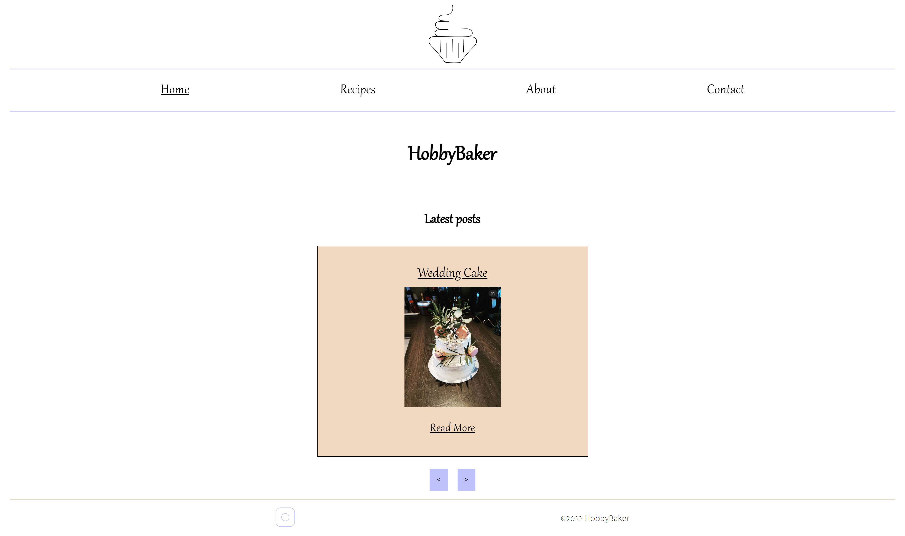

# HobbyBaker

## Description

- My motivation for this project was to learn how to make a blog using REST API.

- I built this website so I could learn more about how to code and learn more about fetching from REST API's.

- On this website, you can see images of homemade cakes and read the recipes.

- In this project, I learned how to build a user-friendly, clean and neat blog.

## Built with

- HTML
- CSS
- JavaScript
- WordPress Headless CMS
- REST API

## Contributing

If you want to contribute on this blog here are the steps you should follow:

1.

## Contact
